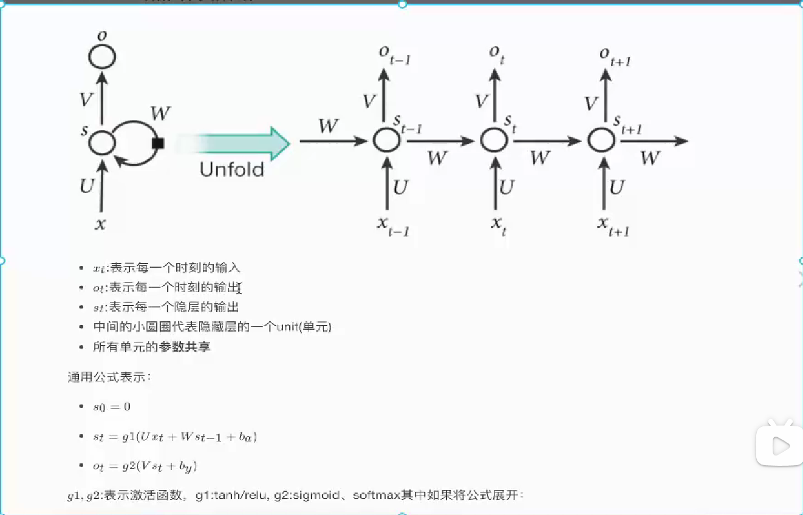
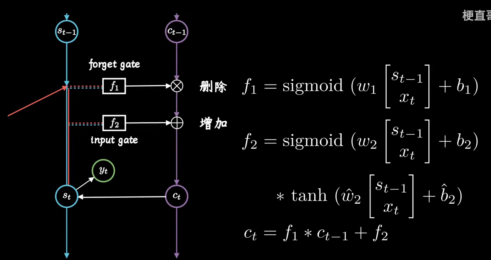
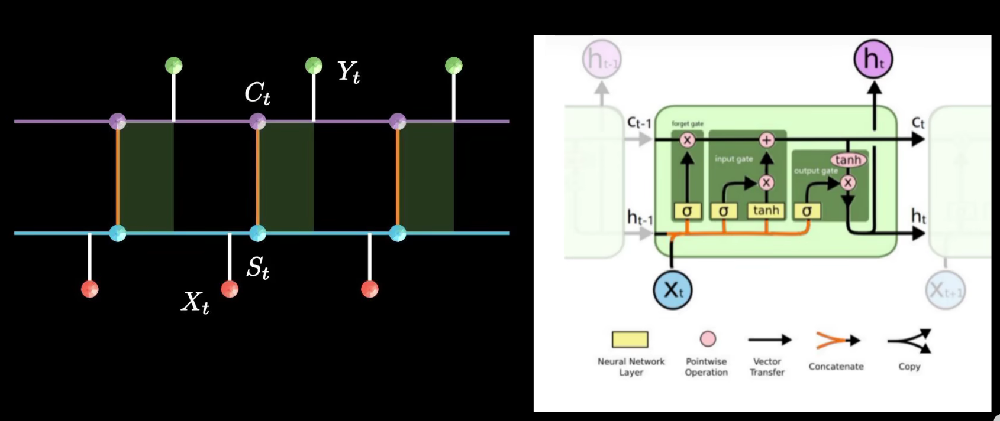
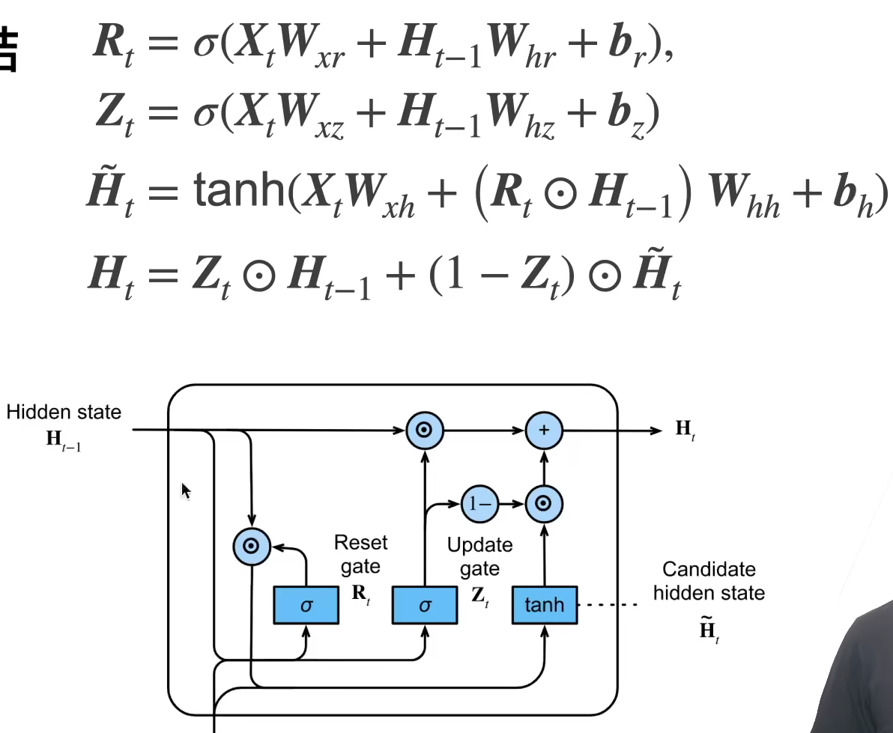
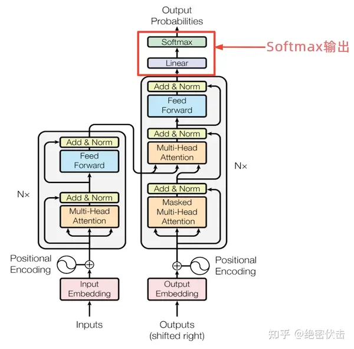
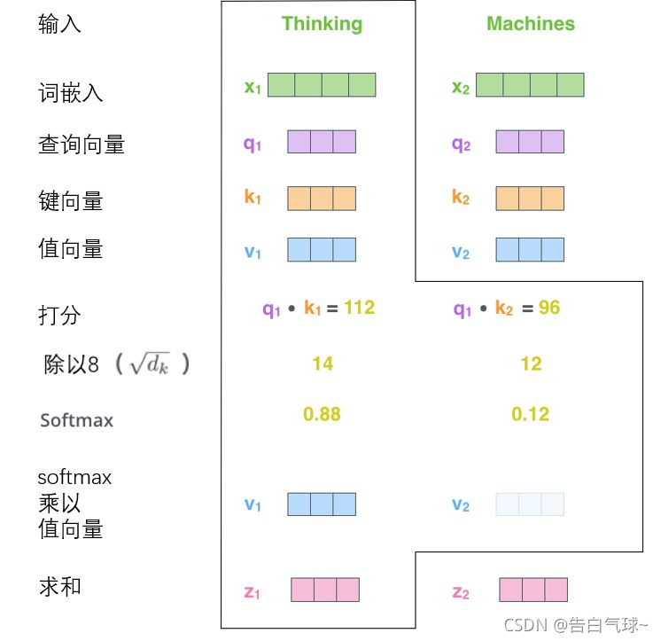
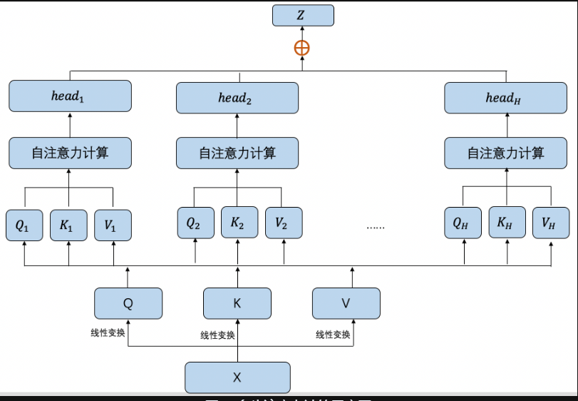
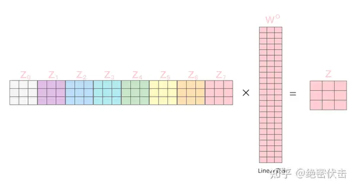
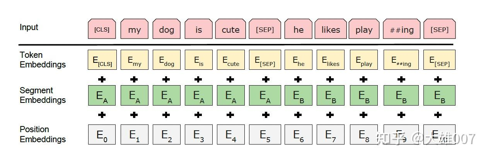

# *自然语言处理*

## 我的学习路径：

**RNN——LSTM——GRU——seq2seq——attention——transformer——BERT——GPT**

本质：对语言进行语义的提取，即理解语句中的意思，学习到理解能力后可以对模型进行应用

模型：首先确定一个损失函数，损失函数决定了模型能够学到什么，因为模型是根据损失函数不断更新的。
然后搭建结构，结构中的参数决定了模型是如何学习的，最后通过损失函数对参数的不断调整使得模型获得了方法，通过方法，能够处理任务相同具体内容不同的任务

模型搭建：目的是为了使用多个参数矩阵去近似人类处理任务时的过程

------

https://aistudio.baidu.com/education/lessonvideo/1451160

笔记：

1.神经网络：

基本单元：感知机mlp；
前向传播：获得权重参数
反向传播：损失函数变化量是权重参数，损失函数的负梯度下降最小化损失函数更新参数，以达到最有值

2.词表示：

one-hot编码：特征稀疏，词间独立
embedding编码：特征稠密，词间有联系

词向量模型
word2vec：
	skip-gram：
输入中心词的one-hot编码，通过设置随机参数的词向量矩阵获取词向量，将中心词词向量与各个上下文权重w2相乘使用softmax分类获取概率，通过损失函数的梯度下降反向传播更新词向量矩阵
	cbow：输入的是上下文

俩者：前者对于同一个词的学习更加准确，即词向量拟合的更好；后者：学习的平均水平更好，整体的词向量矩阵的效果更好

3.句子编码神经网络：

自回归语言模型：
RNN循环神经网络：处理不定长的序列，容易梯度爆炸或消失，只能顺序处理序列，太长序列会遗忘
slef-attention：并行，长距离依赖性好
transformer：残差连接，层归一化，多头注意力机制

4.预训练学习

自回归：
自编码

------

https://www.paddlepaddle.org.cn/tutorials/projectdetail/3731547

笔记：

使用深度神经网络处理语言数据必须解决的问题：

* 变长语句：深度神经网络输入的张量大小是相同的，而语句是不定长的。

  * 解决：截断和填充

* 语句顺序：语句的输入顺序会影响语句的语义

  * 解决：各种

## **nlp经典神经网络：**

### RNN

（循环神经网络）：

在一个时间步内，只有一个神经元在工作，在全部时间步内可以看作全连接神经网络。
每一时间步的隐藏层状态为（输入的词向量\*权重矩阵u+上一时间步的输出\*权重矩阵w）
每一时间步的输出为（隐藏层状态\*权重矩阵V）
每一时间步的所有权重矩阵是不变的，只有隐藏层的状态是随着时间步不断变化的。
隐藏层的状态代表着先前的记忆与当前词的记忆的融合

缺点：

输入的语句越长，训练时容易造成梯度爆炸与梯度消失：

- 无法处理长序列
- 难以捕捉长序列依赖

每一时间步输出依赖上一时间步的输入，在时间上对于语句的处理是串行的

- 无法并行处理语句
- 计算资源消耗大

### LSTM

(长短期记忆网络）：

[【LSTM长短期记忆网络】3D模型一目了然，带你领略算法背后的逻辑_哔哩哔哩_bilibili](https://www.bilibili.com/video/BV1Z34y1k7mc/?spm_id_from=333.337.search-card.all.click&vd_source=598adbb3468a1a6fa1b19211b882b7e3)
[理解LSTM神经网络_哔哩哔哩_bilibili](https://www.bilibili.com/video/BV1vs4y187MN/?spm_id_from=333.337.search-card.all.click&vd_source=598adbb3468a1a6fa1b19211b882b7e3)

LSTM是RNN的变体，基于RNN进行的改造：
	LSTM的隐藏层由长期记忆链c与短期记忆链h组成
	遗忘门：sigmoid（（上一时间步隐藏层h的状态+输入词向量）\*矩阵权重w1）
	输入门：（sigmoid（（上一时间步隐藏层h的状态+输入词向量）\*矩阵权重w2））\*（tanh（（上一时间步隐藏层h的状态+输入词向量）\*矩阵权重w））
	输出门：（（上一时间步隐藏层h的状态+输入词向量）\*矩阵权重w3）\*（tanh（当前隐藏层c的状态））

​	每一个时间步的隐层状态为：
​		长期记忆链：（上一时间步隐藏层c的状态\*遗忘门+输出门）
​		短期记忆链：（（上一时间步隐藏层h的状态+输入词向量）\*矩阵权重w）\*（tanh（当前隐藏层c的状态））
​	每一个时间步的输出为：
​		（（上一时间步隐藏层h的状态+输入词向量）\*矩阵权重w）\*（tanh（当前隐藏层c的状态））
​		与短期记忆链输出相同

缺点：

每一时间步输出依赖上一时间步的输入，在时间上对于语句的处理是串行的

- 无法并行计算

网络由多个门控单元组成，参数数量多

- 计算量大

- 易过拟合

- 不易调优

### GRU

（门控循环单元）：

[56 门控循环单元（GRU）【动手学深度学习v2】_哔哩哔哩_bilibili](https://www.bilibili.com/video/BV1mf4y157N2/?spm_id_from=333.337.search-card.all.click)

GRU是lstm的变体，基于lstm进行改造：
	本质上与rnn相同，都是保存隐藏状态到下一层使用
	但是RNN保存所有过去+现在的状态，而GRU则保存部分过去+部分与现在有关的状态

重置门：sigmoid（上一时间步隐层状态\*w+输入\*w）
更新门：sigmoid（上一时间步隐层状态\*w+输入\*w）
重置门决定了哪些信息应该被遗忘，而更新门决定了哪些信息应该被保留。
候选隐藏状态：tanh（输入\*w+重置门\*上一时间步隐层状态）
候选隐藏状态中包含了输入的信息以及上衣时间步中与输入信息相关的信息

每一时间步的隐层状态：
更新门\*候选隐层状态+（1-更新门）*上一时间步隐藏状态

缺点：

每一时间步输出依赖上一时间步的输入，在时间上对于语句的处理是串行的

- 无法并行计算

------
[【神经网络】学习笔记十四——Seq2Seq模型-CSDN博客](https://blog.csdn.net/zhuge2017302307/article/details/119979892)

### seq2seq模型

seq2seq模型原本是由多个单体RNN组成的神经网络模型。主要由俩部分组成：一部分将输入文本序列转化成具有某种关系的向量，另一部分则根据向量来生成新的文本序列，完成了输入序列到新序列的过程。通过seq2seq模型的思想也就产生了编码器与解码器的概念。
编码器与解码器思想就成为了nlp组网的常见技术。

------

[Attention 机制超详细讲解(附代码) - 知乎](https://zhuanlan.zhihu.com/p/149490072?s_r=0)

### Attention机制

详情见下面的transformer

------

[飞桨PaddlePaddle-源于产业实践的开源深度学习平台](https://www.paddlepaddle.org.cn/tutorials/projectdetail/4325287)
[一文了解Transformer全貌（图解Transformer）](https://www.zhihu.com/tardis/zm/art/600773858)

### Transformer

​	由encode编码器与decode解码器组成。
​	（使用Transformer模型预测输出时使用的是decode，但是decode无法捕捉语句上下文的词义导致decode预测效果差。因此引入encode，encode将输入语句以及上下文信息编码成输出向量a，decode根据输出向量a以及输入语句向量b进行预测。）

​	encode：
​		输入模块：输入语句词向量与位置编码向量叠加获得输入向量a1，a2，a3······
​		隐藏层模块：
​			multi-head attention（多头注意力机制）
​			add&norm（残差连接与层归一化）
​			linear（全连接层）
​		输出模块：输出encode编码向量b1，b2，b3·······

​	decode：
​		输入模块：（输入语句词向量与位置编码向量叠加输入向量a）\*mask向量
​		隐藏层模块：
​			α-multihead attention
​			add&norm（残差连接与层归一化）
​			β-multihead attention
​			linear（全连接层）	
​		输出模块：输出模块：输出decode编码向量b1，b2，b3·······

​	输出层：
​		linear（全连接层）
​		softmax

多头注意力机制：

​	单个attention实现过程：
​	1.将输入向量a[]\*权重矩阵Wq，Wk，Wv让每个输入向量都获得向量Q，K，V
​	2.将（当前的输入向量a1的向量Q）点乘（每一个输入向量a1，a2······的向量K）获得分数[]
​	3.将分数[]降维	
​	4.softmax（分数）
​	5.将（当前的输入向量a1的向量V）乘以（softmax（分数））获得V11，V12····
​	6.将V11，V12····相加求和获得向量b'
​	7.将向量b'经过线性层获得输出向量b1（此时的b1包含着输入向量a以及它的上下文信息）

​	多头attention实现过程：
​	对于attention层，同时设置了多对权重矩阵Wq，Wk，Wv，获得了多对不同的向量Q，K，V，每一个向量Q，K，V求出多个不同的输出向量b'，将b'拼接起来再经过线性层获得输出向量b1（此时b1同样包含着输入向量a以及它的上下文信息）
​	为什么使用多头attention：
​	相比单个attention，多头attention设置多对权重矩阵可以避免单个权重矩阵Wq，Wk，Wv的错误设置影响模型的提取能力，可以更好的提取语义特征。

decode中有俩个attention层：
	α-multihead attention：
	与encode中常规的输入输出的attention不同，第一个attention层的输入同样是语句词向量，但是decode是为了预测语句的下一个词，所以不能让它知道完整的语句，因此α-multihead attention的输入是（（输入语句词向量与位置编码向量叠加输入向量a）\*mask向量）使用mask向量掩盖将要预测的部分

​	β-multihead attention：
​	输入是(α-multihead attention经过线性变换后的输出向量b(α))以及(encode输出向量b),前者用于\*权重矩阵Wq，后者用于\*权重矩阵Wk，Wv。其余操作相同，输入不同。

---
[69 BERT预训练【动手学深度学习v2】_哔哩哔哩_bilibili](https://www.bilibili.com/video/BV1yU4y1E7Ns/?spm_id_from=333.999.0.0&vd_source=598adbb3468a1a6fa1b19211b882b7e3)
[读懂BERT，看这一篇就够了 - 知乎](https://zhuanlan.zhihu.com/p/403495863)

### BERT

(Bidirectional Encoder Representation from Transformers)

bert模型是一个只由transformer中的encode组成的模型，特点为对输入语句进行语义语法以及语句间关系的特征提取。
因为它的可以提取特征，具有很好的普适性，所以可以用来作为nlp各种任务的预训练模型，只需要在训练好的bert模型上进行fine-tuning（微调）即可完成不同的nlp任务。

bert模型与transformer中encode的不同点：

	**输入向量不同**：bert的输入由三部分向量相加得到。
		Special Tokens层：BERT使用特殊标记（如`[CLS]`和`[SEP]`)来提供关于输入序列结构的信息。`[CLS]`标记位于					      序列的开始，用于分类任务；`[SEP]`标记用于分隔句子或句子对。
		token层：将输入语句分为最小词单元；
		segment层：将输入的句子进行区别，表示输入的一段话中的不同句子；
		position层：对输入词进行位置编码，但是编码方式不再只有三角函数得1固定编码方式，而是使用学习方式进				     行编码；
	**任务不同**：通过给模型设置任务，让模型对任务的完成来获得相应的能力。bert通过设置俩个任务：MLM与NSP（Next Sentence Prediction)来实现对语句的特征提取以及语句间的关系提取。
		MLM：对输入的语句中的部分词进行掩码，通过训练对掩码词进行预测，要完成该任务bert模型必须学会通过上下文来预测词，也就实现了特征提取。
		NSP:对输入的语句对进行判断是否语句相似，要完成该任务bert模型必须先学会对语句的语义进行提取再判断相似性。

---

bert与gpt区别：
BERT：双向 预训练语言模型+fine-tuning（微调）
GPT：自回归 预训练语言模型+Prompting（指示/提示）

### GPT

（generative pre-trained transformer）：

